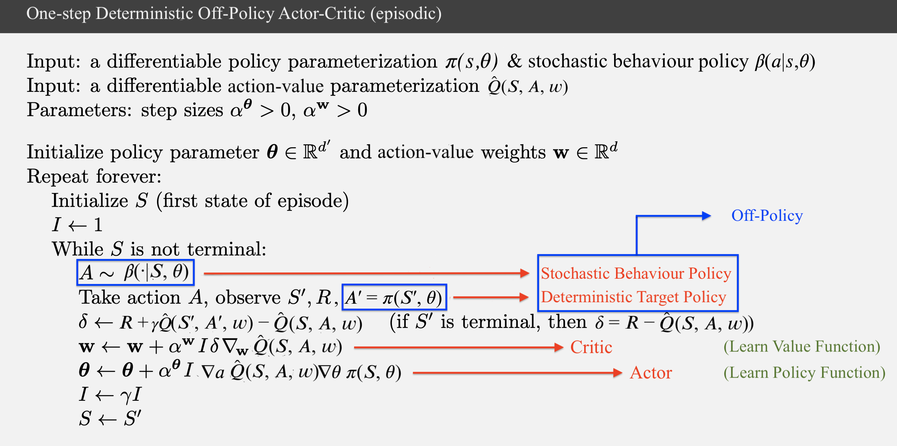
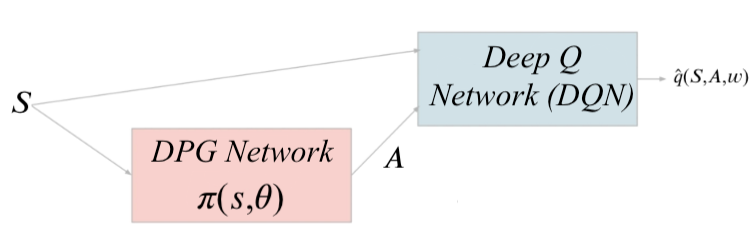
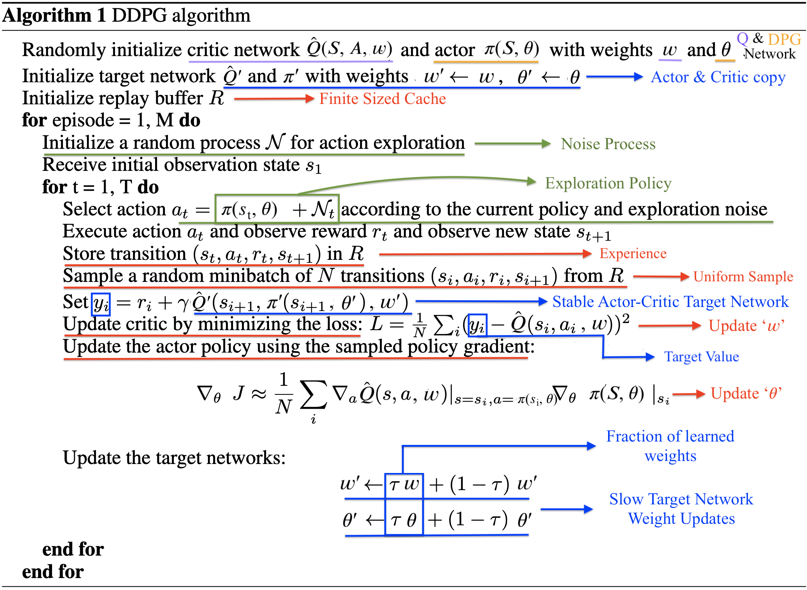

# DEEP DETERMINISTIC POLICY GRADIENTS

An RL agent interacts with its environment, takes an action, and learns more about the environment, influencing subsequent actions and learning. Like an RL agent, we can think of the process of learning about deep deterministic policy gradients as navigating an enviroment consisiting of 3 states. The start state being the policy gradient state. Once we have a basic understanding of the policy gradient state, we take an action which leads us to the Deterministic Policy Gradients state. Finally we take the action that leads us to our goal state, i.e., Deep Deterministic Policy Gradients.

**Let's head to our start state - Policy Gradients**

# 1. Policy Gradients

## 1.1 Definition
Policy gradient methods learn a parameterized policy that can select actions without consulting a value function. They model and optimize the policy directly.

$$\pi(a|s, \theta)=Pr\{A_{t} = a\ | S_{t} = s, \theta_{t} = \theta\}$$

This equation denotes the probability that action a is taken at time t given that the environment is in state s at time t with parameter $\theta$.

An example of a policy:
\begin{equation*}
\pi(a|s, \theta) = \frac{e^{h(s, a, \theta)}} {\sum_{b}{e^{h(s, b, \theta)}}}
\end{equation*}

Reminds you of the softmax equation we so often see in machine learning, doesn't it?
We call this kind of policy parameterization as *softmax in action preferences*.
Like in machine learning we have $h(s, a, \theta) = \theta^T x(s, a)$ where $x(s, a)$ is a feature vector and $\theta$ are the weights.

**Now that we've covered the *Policy* portion, let's move on to the *Gradient* portion.**

## 1.2 Policy Gradient Theorem
Let's define our expected reward. We represent the total reward for a given trajectory $\tau$ as $r(\tau)$.<br />

$$J(\theta) = {E_{\pi}}[r(\tau)]$$ <br />
As we've seen before the expected reward is the value of the start state $s_{0}$ under a policy $\pi_{\theta}$.<br />
Therefore we have:<br />
$$J(\theta) = v_{\pi_{\theta}}(s_{0}) = {E_{\pi}}[r(\tau)]$$

The equations look pretty cool, but what next?<br />
We can derive some intuition from the loss functions used in machine learning. A loss function is defined with respect to the parameters $\theta$ and we use **gradient descent** to find the parameters $\theta$ that minimize the loss. 

$$\theta_{t+1} = \theta_{t} - \alpha \nabla L(\theta_{t})$$

In Reinforcement Learning, however, we want to maximize the expected reward, so what do we do? Well, pretty simple, we go up instead of down, i.e., **gradient ascent** instead of gradient descent.

$$\theta_{t+1} = \theta_{t} + \alpha \nabla J(\theta_{t})$$
>*When the solution is simple, God is answering. - Albert Einstein*

We're going to use gradient ascent to maximize our expected reward, but before we can do that, we need to define the following derivative $\nabla J(\theta_{t})$.
Now we can derive this, but we're going to save ourselves some time and present the answer:

$$\nabla J(\theta_{t}) = \nabla_{\theta} \sum_{s}\mu(s)\sum_{a}q_{\pi_{\theta}}(s, a)\pi_{\theta}(a|s,\theta)$$
$$\nabla J(\theta_{t}) \propto \sum_{s}\mu(s)\sum_{a}q_{\pi_{\theta}}(s, a)\nabla_{\theta}\pi_{\theta}(a|s,\theta)$$

This can be proved mathematically, but for now we're just going to trust that we have the right answer.<br />
Our gradient update can now be written as:

$$\theta_{t+1} = \theta_{t} + \alpha \nabla J(\theta_{t})$$

$$\theta_{t+1} = \theta_{t} + \alpha \sum_{s}\mu(s)\sum_{a}q_{\pi_{\theta}}(s, a)\nabla_{\theta}\pi_{\theta}(a|s,\theta)$$

*There you are, left alone, lost in a mountain range surrounded by snow. What do you do? You decide to get to the highest point and light up a flare so that someone can come to rescue you. Turns out what you are going to do is gradient ascent. Look as far as you can in every direction and find the direction that gets you the highest. Go in that direction.*


Now that we have defined our gradient update let's take a look at an example to solidify our understanding.

### 1.2.1 Example

Let's consider an MDP with a single state $s$ and three actions $a_{1}, a_{2}, a{_3}$. Let's assume we start off with an approximate q_value function $q(s, a)$.\
Since we have only one state we can ignore the $\sum_{s}\mu(s)$ term.\
Let's use the *softmax in action preferences* policy:
\begin{equation*}
\pi(a|s, \theta) = \frac{e^{h(s, a, \theta)}} {\sum_{b}{e^{h(s, b, \theta)}}}
\end{equation*}
So the gradient update will be:

$$\theta_{t+1} = \theta_{t} + \alpha \sum_{a}q_{\pi_{\theta}}(s, a)\nabla_{\theta}\pi_{\theta}(a|s,\theta)$$
Let $a1$ be the optimal action in state $s$.

If we apply policy gradient to this example, we would want the probability of the optimal action $a1$ to increase and the probability of actions $a2$ and $a3$ to decrease:

\begin{equation*}
\pi(a1|s, \theta) = \frac{e^{h(s, a1, \theta)}} {\sum_{b}{e^{h(s, b, \theta)}}} \approx 1
\end{equation*}

\begin{equation*}
\pi(a2|s, \theta) = \frac{e^{h(s, a2, \theta)}} {\sum_{b}{e^{h(s, b, \theta)}}} \approx 0
\end{equation*}

\begin{equation*}
\pi(a3|s, \theta) = \frac{e^{h(s, a3, \theta)}} {\sum_{b}{e^{h(s, b, \theta)}}} \approx 0
\end{equation*}

As shown in the example, as the agent interacts with the environment it performs a gradient update. It updates the parameters $\theta$ to maximize the reward $J(\theta)$. The parameter updates take a step in the direction of the expected reward. The updates should increase the weights $\theta$ for features $x(s,a1)$ corresponding to action $a1$ and decrease the weights $\theta$ for features $x(s,a2)$ and $x(s,a3)$ corresponding to actions $a2$ and $a3$.

As the agent continues to interact with the environment, gradient ascent updates the parameters $\theta$ which increases the value of $h(s,a1,\theta)$ and decreases the value of $h(s,a2,\theta)$ and $h(s,a3,\theta)$. This leads to an increase in the softmax probability of action $a1$ and decreases the softmax probability of actions $a2$ and $a3$. The probability of action $a1$ gets closer to 1 while the probability of actions $a2, a3$ get closer to 0


# 1.3 Policy Gradient Algorithms
Now that we have a general idea of the intuition behind policy gradients, we can derive policy gradient learning algorithms. We won't go into too much detail, but rather briefly explain how each learning algorithm estimates the parameters $\theta$ for the policy $\pi(a|s, \theta)$.

The following equation form the basis of the learning algorithms:

$$\nabla J(\theta) = \nabla_{\theta} \sum_{s}\mu(s)\sum_{a}q_{\pi_{\theta}}(s, a)\pi_{\theta}(a|s,\theta)$$

$$\nabla J(\theta) \propto \sum_{s}\mu(s)\sum_{a}q_{\pi_{\theta}}(s, a)\nabla_{\theta}\pi_{\theta}(a|s,\theta)$$

$$\nabla J(\theta) = {E_{\pi_{\theta}}}[\sum_{a}q_{\pi_{\theta}}(S_{t}, a)\nabla_{\theta}\pi_{\theta}(a|S_{t},\theta)]$$

$$\theta_{t+1} = \theta_{t} + \alpha \sum_{a}q(S_{t}, a)\nabla_{\theta}\pi_{\theta}(a|S_{t},\theta)$$

The algorithms that are based on updates that involve all of the actions are called all-action methods. We leave that out for now and we study the classical **REINFORCE** algorithm, whose update at time $t$ involves just a single action $A_{t}$ taken at time $t$ by the policy. Since we are using an action $A_{t}$ taken at time t by the policy, this could lead to a problem where the algorithm happens to update actions that have higher values of $\pi_{\theta}$ more often. Unfortunately this can be affected by how $\pi_{\theta}$ has been initialized. To avoid this we need to perform on-policy correction, where we need to compensate for the fact that the more probable actions are going to be updated more often. To correct this we weight the term by $\pi_{\theta}(a|s,\theta)$, so if an action $A_{t}$ is sampled $X$ times more often than the other actions, we are going to have $X$ times more updates, however each update will be $X$ times smaller.

On policy correction results in the following equations:

$$\nabla J(\theta) = {E_{\pi_{\theta}}}[\sum_{a}\pi_{\theta}(a|S_{t},\theta)q_{\pi_{\theta}}(S_{t}, a)\frac{\nabla_{\theta}\pi_{\theta}(a|S_{t},\theta)}{\pi_{\theta}(a|S_{t},\theta)}]$$
$$\nabla J(\theta) = {E_{\pi_{\theta}}}[q_{\pi_{\theta}}(S_{t}, A_{t})\frac{\nabla_{\theta}\pi_{\theta}(A_{t}|S_{t},\theta)}{\pi_{\theta}(A_{t}|S_{t},\theta)}]$$

Keeping this in mind we move on to our first Policy Gradient Algorithm.

<a id='REINFORCE'></a>

### 1.3.1 REINFORCE: Monte Carlo Policy Gradient
As the name mentions we use the the monte carlo method to estimate $q_{\pi_{\theta}}(S_{t}, A_{t})$. We calculate the expected return $G_{t}$. So the equation for the policy gradient is:

$$\nabla J(\theta) = {E_{\pi_{\theta}}}[G_{t}\frac{\nabla_{\theta}\pi_{\theta}(A_{t}|S_{t},\theta)}{\pi_{\theta}(A_{t}|S_{t},\theta)}]$$
The parameter update is:
$$\theta_{t+1} = \theta_{t} + \alpha G_{t}\frac{\nabla_{\theta}\pi_{\theta}(A_{t}|S_{t},\theta)}{\pi_{\theta}(A_{t}|S_{t},\theta)}$$


### 1.3.2 REINFORCE with Baseline
The policy gradient theorem can be generalized to include a comparison of the action value to an arbitary baseline $b(s)$. You can think of $b(s)$ as a true label.

$$\nabla J(\theta) \propto \sum_{s}\mu(s)\sum_{a}(q_{\pi_{\theta}}(s, a)-b(s))\nabla_{\theta}\pi_{\theta}(a|s,\theta)$$

Including this baseline does not affect the gradient, as shown below:

$$\sum_{a}b(s)\nabla_{\theta}\pi_{\theta}(a|s,\theta) = b(s)\nabla_{\theta}\sum_{a}\pi_{\theta}(a|s,\theta) = b(s)\nabla_{\theta}1 = 0$$

The baseline $b(s)$ can be any function, even a random variable, as long as it does not vary with $a$.

The equation for the policy gradient is:

$$\nabla J(\theta) = {E_{\pi_{\theta}}}[(G_{t}-b(S_{t}))\frac{\nabla_{\theta}\pi_{\theta}(A_{t}|S_{t},\theta)}{\pi_{\theta}(A_{t}|S_{t},\theta)}]$$
The parameter update is:
$$\theta_{t+1} = \theta_{t} + \alpha (G_{t}-b(S_{t}))\frac{\nabla_{\theta}\pi_{\theta}(A_{t}|S_{t},\theta)}{\pi_{\theta}(A_{t}|S_{t},\theta)}$$

A natural choice for the baseline is an estimate of the state value $\hat v(S_{t}, w)$, where $w$ is a weight vector that is learned. Baselines don't affect the expected value of the update, but can reduce the variance, which speeds up the learning. In summary, a baseline will reduce the variance while keeping the gradient unbiased.


### 1.3.3 Actor-Critic Methods
In these methods the "actor" is a reference to the learned policy, and the "critic" is a reference to the learned value function. Although the REINFORCE with Baseline learns both a policy and a state value function, it is not considered an actor-critic method because the learned state value function is used as a baseline and not a critic. For the state value function to be a critic we need to include it as a bootstrapped estimate of the expected return.

$$\nabla J(\theta) = {E_{\pi_{\theta}}}[(G_{t:t+1}-\hat v(S_{t}, w))\frac{\nabla_{\theta}\pi_{\theta}(A_{t}|S_{t},\theta)}{\pi_{\theta}(A_{t}|S_{t},\theta)}]$$

$$\nabla J(\theta) = {E_{\pi_{\theta}}}[(R_{t+1}+\gamma\hat v(S_{t+1}, w)-\hat v(S_{t}, w))\frac{\nabla_{\theta}\pi_{\theta}(A_{t}|S_{t},\theta)}{\pi_{\theta}(A_{t}|S_{t},\theta)}]$$

The parameter update is:

$$\theta_{t+1} = \theta_{t} + \alpha (R_{t+1}+\gamma\hat v(S_{t+1}, w)-\hat v(S_{t}, w))\frac{\nabla_{\theta}\pi_{\theta}(A_{t}|S_{t},\theta)}{\pi_{\theta}(A_{t}|S_{t},\theta)}$$

Since we use bootstrapping, we introduce bias - an asymptotic dependence on the quality of the function approximation. The introduction of bias reduces variance and speeds up the learning. The REINFORCE methods presented in the earlier sections are unbiased, but the speed of learning is much slower. With actor-critic methods we also do not need to wait till the end of an episode (like the REINFORCE methods) to make an update.


## 1.4 Why Policy Gradients
We've seen how policy gradients work, but we haven't yet convinced you on why you would want to use them. We're going to try and do that now. We're going to present some advantages and that should give you some intuition on why you may want to use policy gradient algorithms. Unfortunately, there's always a downside, which we present in the disadvantages section.

### 1.4.1 Advantages

#### 1.4.1.1 Convergence
* Policy based methods have better convergence properties.
* The problem with value based methods is the choice of action may vary for a small change in the estimated Q values. Since the action can vary for small changes, the value functions tend to vary in every iteration.
* In Policy Gradient, we use gradient ascent. We move the $\theta$ values in the direction of the gradient $\nabla_{\theta}J(\theta)$. Since we follow the gradient, we're guaranteed to converge to a local maximum (worst case) or a global maximum (best case).


#### 1.4.1.2 High Dimensional Action Spaces
* Policy gradients are more useful in continuing tasks or tasks that contain a very large action space.
* The problem with GPI algorithms, is the action predictions are based on the maximum expected reward for each possible action, at each time step, given the current state. This requires a search of the entire action space and this is what we call the curse of dimensionality.
* Policy gradients, on the other hand, would just require a feature vector h(s, a, $\theta$), a set of adjustable parameters, to perform the softmax computation and pick an action. 


#### 1.4.1.3 Stochastic Policies
* Policy gradients can learn stochastic policies. We've already seen an example of a stochastic policy, the softmax policy:
\begin{equation*}
\pi(a|s, \theta) = \frac{e^{h(s, a, \theta)}} {\sum_{b}{e^{h(s, b, \theta)}}}
\end{equation*}
* Value based methods are unable to learn stochastic policies.
* An advantage of stochastic policies is we don't need to have an exploitation v/s exploration trade off.

### 1.4.2 Disadvantages
#### 1.4.2.1 Convergence
* An obvious disadvantage is that the gradient ascent can converge to local maximum instead of the global maixmum, which would yield a suboptimal policy.


**Now that we have a better understanding of the policy gradients, we can take the action that takes us from the policy gradient state to the Deterministic Policy Gradients state**

# 2. Deterministic Policy Gradients

## 2.1 Definition
In the policy gradients discussed above, the policy $\pi(a|s, \theta)$ is a probability distribution over the actions given the current state, i.e., it is a stochastic policy. **Deterministic policy gradient (DPG)** instead learns a parameterized policy that selects actions as a deterministic decision.

$$a = \pi_{\theta}(s, \theta)$$

This simple form means that the deterministic policy gradient can be estimated much more efficiently than the usual stochastic policy gradient. An obvious advantage from a practical standpoint is that a stochastic policy gradient would require more samples to estimate as compared to a deterministic policy gradient. This is because for a stochastic policy gradient we have to compute the sum over both the state and action spaces, whereas in the deterministic policy gradient we only sum over the state space. This presents a huge advantage in environments where the dimension of the action space is large. Now let's dive into some theory behind deterministic policy gradients.

## 2.2 Deterministic Policy Gradient Theorem
Taking inspiration from the policy gradient theorem presented above, we can define the objective for deterministic policy gradient (deterministic analogue to the policy gradient theorem) as follows:

$$J(\theta) = \sum_{s}\mu(s)q_{\pi_{\theta}}(s, \pi_{\theta}(s,\theta))$$
$$J(\theta) = {E_{\pi_{\theta}}}[q_{\pi_{\theta}}(s, \pi_{\theta}(s,\theta))]$$

$$\nabla J(\theta) = \nabla_{\theta} \sum_{s}\mu(s)q_{\pi_{\theta}}(s, \pi_{\theta}(s,\theta))$$
$$a=\pi_{\theta}(s,\theta))$$

$$\nabla J(\theta) = \sum_{s}\mu(s)\nabla_{a}q_{\pi_{\theta}}(s, a)\nabla_{\theta}\pi_{\theta}(s,\theta)$$

$$\nabla J(\theta) = {E_{\pi_{\theta}}}[\nabla_{a}q_{\pi_{\theta}}(s, a)\nabla_{\theta}\pi_{\theta}(s,\theta)]$$

We could apply this objective to one of the methods discussed above like actor-critic. This would give us a deterministic on-policy actor-critic algorithm.

$$\nabla J(\theta) = {E_{\pi_{\theta}}}[\nabla_{a}G_{t:t+1}\nabla_{\theta}\pi_{\theta}(s,\theta)]$$

$$\nabla J(\theta) = {E_{\pi_{\theta}}}[\nabla_{a}\hat q_{\pi_{\theta}}(s, a, w)\nabla_{\theta}\pi_{\theta}(s,\theta)]$$

We substitue a differentiable action value function $\hat q_{\pi_{\theta}}(s, a, w)$ in place of the true action value function $q_{\pi_{\theta}}(s, a)$. The parameter updates in the on-policy actor critic method would involve the following steps:

$$A_{t}=\pi_{\theta}(S_{t},\theta)), A_{t+1}=\pi_{\theta}(S_{t+1},\theta))$$

$$\delta_{t} = R_{t+1} + \gamma\hat Q_{\pi_{\theta}}(S_{t+1}, A_{t+1}, w) - \hat Q_{\pi_{\theta}}(S_{t}, A_{t}, w)$$

$$w_{t+1} = w_{t} + \alpha_{w}\delta_{t}\nabla_{w}\hat Q_{\pi_{\theta}}(S_{t}, A_{t}, w)$$

$$\theta_{t+1} = \theta_{t} + \alpha_{\theta}\nabla_{a}\hat Q_{\pi_{\theta}}(S_{t}, A_{t}, w)\nabla_{\theta}\pi_{\theta}(S_{t},\theta)$$

The problem with an on policy method in deterministic policy gradients is the absence of exploration. Since the policy is deterministic, it is not going to place an emphasis on exploration and would rather exploit the actions selected deterministically. To explore the state and action space we can use an off-policy learning algorithm where the behaviour policy is a stochastic policy (encourages exploration) and the target policy is the deterministic policy.


## 2.3 Off-Policy Deterministic Actor-Critic
We use off-policy learning to learn a deterministic target policy $\pi_{\theta}(s, \theta)$ from sequences generated by an arbitrary stochastic behaviour policy $\beta_{\theta}(s, a, \theta)$.
We modify the objective function to represent off-policy learning:

$$J(\theta) = \sum_{s}\mu_{\beta_{\theta}}(s)q_{\pi_{\theta}}(s, \pi_{\theta}(s,\theta))$$

$$J(\theta) = {E_{\beta_{\theta}}}[q_{\pi_{\theta}}(s, \pi_{\theta}(s,\theta))]$$

$\mu_{\beta_{\theta}}$ represents the state distribution under the stochastic behaviour policy $\beta_{\theta}(a|s, \theta)$.

$$\nabla J(\theta) = \nabla_{\theta} \sum_{s}\mu_{\beta_{\theta}}(s)q_{\pi_{\theta}}(s, \pi_{\theta}(s,\theta))$$

$$a=\pi_{\theta}(s,\theta))$$

$$\nabla J(\theta) = \sum_{s}\mu_{\beta_{\theta}}(s)\nabla_{a}q_{\pi_{\theta}}(s, a)\nabla_{\theta}\pi_{\theta}(s,\theta)$$

$$\nabla J(\theta) = {E_{\beta_{\theta}}}[\nabla_{a}q_{\pi_{\theta}}(s, a)\nabla_{\theta}\pi_{\theta}(s,\theta)]$$

We can derive an update rule similiar to the on-policy case. We substitue a differentiable action value function $\hat q_{\pi_{\theta}}(s, a, w)$ in place of the true action value function $q_{\pi_{\theta}}(s, a)$. The parameter updates in the off-policy actor critic method would involve the following steps:

$$A_{t}=\beta_{\theta}(\bullet|S_{t},\theta)), A_{t+1}=\pi_{\theta}(S_{t+1},\theta))$$

$$\delta_{t} = R_{t+1} + \gamma\hat Q_{\pi_{\theta}}(S_{t+1}, A_{t+1}, w) - \hat Q_{\pi_{\theta}}(S_{t}, A_{t}, w)$$

$$w_{t+1} = w_{t} + \alpha_{w}\delta_{t}\nabla_{w}\hat Q_{\pi_{\theta}}(S_{t}, A_{t}, w)$$

$$\theta_{t+1} = \theta_{t} + \alpha_{\theta}\nabla_{a}\hat Q_{\pi_{\theta}}(S_{t}, A_{t}, w)\nabla_{\theta}\pi_{\theta}(S_{t},\theta)$$

Two key points to note are:
1. The deterministic policy gradient removes the summation over the actions, therefore we don't need to perform off-policy correction (importance sampling) for the actor.
2. The algorithm presented above uses Q-learning, which avoids having to include importance sampling in the critc.

The deterministic policy gradient theorem can be plugged into common policy gradient frameworks presented in the previous sections. 



These gradients can be estimated more efficiently than their stochastic counterparts, since they avoid the summation over the action space.

**Now that we have covered deterministic policy policy gradients, we can finally move to our goal state, Deep Deterministic Policy Gradients**

# 3. Deep Deterministic Policy Gradients

## 3.1 Definition
**Deep Deterministic Policy Gradients (DDPG)** is an actor-critic, model-free algorithm based on the **Deep Q Network (DQN)** and **Deterministic Policy Gradient (DPG)** that can operate over continuous action spaces. DDPG concurrently learns a Q-function and a policy. It uses experience replay and target networks from DQN, and it is based on DPG, which can operate over continuous action spaces.

## 3.2 Motivation
You can think of Deep Deterministic Policy Gradients (DDPG) as a solution to the problems of Deep Q Networks (DQN) and Deterministic Policy Gradients (DPG).


### 3.2.1 Deterministic Policy Gradients (DPG)
Deterministic policy gradients learn a parameterized policy that selects actions as a deterministic decision.

$$a = \pi_{\theta}(s, \theta)$$ 

**Pros:**
* DPG is useful in continuing tasks or tasks that contain a very large action space.
* DPG avoids having to loop over the action space

**Cons:**
* A direct application of neural function approximators in DPG is unstable and causes the learning algorithm to diverge.
* Training an actor-critic DPG with temporally-correlated samples introduces a large amount of variance in the Q values

### 3.2.2 Deep Q Networks (DQN)
There has been significant improvements in deep learning approaches used in reinforcement learning. The basis of these approaches is to use a deep neural network function approximator to estimate the action-value function. 

$$a = \underset{a}{\operatorname{argmax}}\hat Q_{\pi}(s, a, w)$$ 
**Pros:**
* DQN is able to learn value functions in a stable and robust way using a deep neural network function approximator.
* The first innovation of DQN that enables learning the value functions is the use of a replay buffer to minimize correlations between samples and a target network to maintain stability while learning

**Cons:**
* For problems that contain high dimensional state and continous action spaces, the DQN approach performs poorly, becauses it involves a max operation over all possible actions. 
* This max operation is trivial for problems with a finite number of discrete actions, but when the action space is continous, discretizing the action space to exhaustively evaluate the space, and solving the action value optimization is highly Inefficient. 

### 3.2.2 Solution (DDPG)
What if we took the pros of the DQN algorithm and the pros of the DPG algorithm to negate the effect of the cons of both the algorithms? This is exaclty what the authors behind DDPG did.

* DDPG selects the actions using a deterministic policy, thereby avoiding the max operation of Q-values over all possible actions.
* DDPG adopts the DQN strategy of using a replay buffer and a target Q network to reduce the variance of Q values and improve stability in learning.

These two key points ensure that DDPG can work on continous action spaces (select actions using DPG) and reduce variance and improve stability while learning the gradient and Q-value parameters.



## 3.3 Algorithm

### 3.3.1 Description
The Deep Deterministic policy gradient is an off-policy actor critic approach based on deterministic policy gradients.

* Actor: $\pi_{\theta}(s, \theta)$
* Critic: $\hat Q_{\pi_{\theta}}(s, \pi_{\theta}(s, \theta), w)$

As discussed in the section on DPG, the learning updates are as follows:

$$A_{t}=\beta_{\theta}(\bullet|S_{t},\theta)), A_{t+1}=\pi_{\theta}(S_{t+1},\theta))$$

$$\delta_{t} = R_{t+1} + \gamma\hat Q_{\pi_{\theta}}(S_{t+1}, A_{t+1}, w) - \hat Q_{\pi_{\theta}}(S_{t}, A_{t}, w)$$

$$w_{t+1} = w_{t} + \alpha_{w}\delta_{t}\nabla_{w}\hat Q_{\pi_{\theta}}(S_{t}, A_{t}, w)$$

$$\theta_{t+1} = \theta_{t} + \alpha_{\theta}\nabla_{a}\hat Q_{\pi_{\theta}}(S_{t}, A_{t}, w)\nabla_{\theta}\pi_{\theta}(S_{t},\theta)$$

Unfortunately applying a deep network naively to estimate the parameters of the actor and the critic leads to poor convergence properties. There are two main reasons for this:
1. The high variance that arises when estimating action values from temporally-correlated simulated trajectories.
2. Instability during learning that arises from the directly updating the actor and critic parameters based on the gradient updates derived from the error signal.

To overcome these shortcomings, modifications to DPG were suggested. These modifications were inspired by the success of DQN's. The two key modifications which are discussed further in the next sections are **Experience Replay** and **Target Networks**.
* Experience Replay: Store a list of tuples (state, action, reward, next_state). Instead of learning from a recent experience, learn by sampling experiences stored in the list. This approach reduces variance.
* Target Networks: As we are learning from estimated targets, we update the target networks slowly. This approach imporves stability.

### 3.3.2 Components
The DDPG algorithm consists of 6 components:
* Q Network
* DPG Network
* Experience Replay
* Target Q Network
* Target Policy (DPG) Network
* Exploration

### 3.3.2.1 Q Network

The critic $\hat Q_{\pi}(S, A, w)$ is learned using the Bellman equation as in Q-learning. For computing the Q values we use the critic network and pass the action computed by the actor networks ($\pi(S, \theta) \space \& \space \pi'(S,\theta')$. The Critic loss is a simple TD-error where we use target networks to compute Q-value for the next state. 

The objective of the critic is to minimize the the Mean-Squared Bellman error (MSBE).


### 3.3.2.2 DPG Network
The DPG algorithm maintains a parameterized actor function $\pi(S, \theta)$ which specifies the current policy by deterministically mapping states to a specific action. The learned policy $\pi(S, \theta)$ will deterministically choose the action that maximizes $\hat Q_{\pi}(S, A, w)$.

The objective of the actor is to maximize the expected return.


### 3.3.2.3 Experience Replay
The optimization algorithms assume that the samples are independent and identically distributed. This assumption is not valid in when samples are generated sequentially. To break up temporal correlation between the samples within training episodes we define a **replay buffer**.

The **replay buffer** is a finite sized cache that stores a list of sample **tuples $(s_{t}, a_{t}, r_{t+1}, s_{t+1})$.** This buffer is sampled uniformly to produce a **minibatch of samples**. This minibatch is used to **update the actor and critic (value and policy networks)** as indicated in the image. Since the minibatch is sampled uniformly, it contains samples that are not temporaly correlated, which reduces variance since we learn across a set of uncorrelated transitions.


### 3.3.2.4 Target Networks (Q & DPG)
Directly implementing Q-learning or DPG with neural function approximators is unstable in many environments. This is due to the fact that the Q network ($\hat Q_{\pi_{\theta}}(S, A, w)$) being updated is also being used as a target value for the updates. To overcome this instability we need to have target values that are constrained and robust.

The solution is to perform soft target updates. This can be done by creating a copy of the actor ($\pi'(S,\theta')$) and critic ($Q'(S, A, w')$) networks. Define the parameters $\theta'$ and $w'$ close to $\theta$ and $w$, but with a time delay of sorts. What this means is that the weights of the target networks are updated by having them slowly track the learned weights. As you can see in the code ($\tau << 1$) only a fraction ($\tau$) of the main weights ($\theta, w$) and a fraction ($1-\tau$) of the target weights ($\theta', w'$) are transferred to ($\theta', w'$). Since the weights of the target networks are updated slowly, the target values ($\pi'(S,\theta') \space \& \space Q'(S, A, w')$) are constrained and change slowly. The target network delays the propagation of value estimations. This may slow learning, but it greatly improves the stabbility of learning.


### 3.3.2.5 Exploration
The advantage of having an off-policy algorithm like DDPG is that we can treat exploration as an independent problem. DDPG trains a deterministic policy using an off-policy actor critic. Since the policy is deterministic, the policy would not explore a wide enough variety of actions to find useful learning signals. 

Since the policy (DPG) is deterministic, we add noise sampled from a noise process $N$ to the actor policy:

$$\pi_{\theta}(S_{t},\theta) + N$$

The noise process N can be decided based on the environment. The authors of the DDPG paper used Ornstein-Uhlenbeck process to generate temporally correlated exploration for exploration efficiency. It samples noise from a correlated normal distribution. Recent research suggests using an uncorrelated, mean-zero Gaussian noise and reducing the noise over the course of training (reducing the rate of exploration - exploit more).


### 3.3.2.6 Pseudocode




# 4. Experiments 

We will run our experiments on the Open AI LunarLander environment. In this environment, the task is to navigate a lander to its landing pad. 

Here is a description of the env:
> Landing pad is always at coordinates (0,0). Coordinates are the first two numbers in state vector. Reward for moving from the top of the screen to landing pad and zero speed is about 100..140 points. If lander moves away from landing pad it loses reward back. Episode finishes if the lander crashes or comes to rest, receiving additional -100 or +100 points. Each leg ground contact is +10. Firing main engine is -0.3 points each frame. Solved is 200 points. Landing outside landing pad is possible. Fuel is infinite, so an agent can learn to fly and then land on its first attempt.

We will deal with the following two versions of this env to test out the different policy gradient algorithms: 
- Lunar Lander (Discrete)
    > Four discrete actions available: do nothing, fire left orientation engine, fire main engine, fire right orientation engine.
- Lunar Lander (Continuous)
    > Action is two real values vector from -1 to +1. First controls main engine, -1..0 off, 0..+1 throttle from 50% to 100% power. Engine can't work with less than 50% power. Second value -1.0..-0.5 fire left engine, +0.5..+1.0 fire right engine, -0.5..0.5 off.
    
<b> For our experiment, we considered an agent to be trained in navigating the lander to the landing pad when the average reward for the last 200 tasks is greater than +200. </b>

### Solving discrete Lunar Lander with REINFORCE policy gradient algorithm

The code can be found [here](https://github.com/prajwal967/rl-project/tree/main/code/reinforce). Here is a plot of <i> Rewards </i>(Y-axis) vs <i>No. of episodes </i> (X-axis):


We trained the above REINFORCE agent for 1700 episodes. The avg reward for the last 200 episodes plateaued around a reward of 140, and the training was stopped without achieving our experiment target of a reward > 200.

### Solving continuous Lunar Lander with DDPG policy gradient algorithm

The code can be found [here](https://github.com/prajwal967/rl-project/tree/main/code/ddpg). Here is a plot of <i> Rewards </i>(Y-axis) vs <i>No. of episodes </i> (X-axis):


The experiment target was successfully achieved by the DDPG agent after running for about ~800 episodes.

# 5. Future Work

* Design and create more examples/animations that can aid in the understanding of these concepts
* Perform an experiment to compare DPG and DDPG
* Create an example that takes the reader through the concepts from a practical standpoint (code walkthorugh)
* As always, we're open to new and interesting ideas!

# 6. References

* Sutton, Richard S., and Andrew G. Barto. [Reinforcement learning: An introduction.](http://www.incompleteideas.net/book/the-book.html)
* Silver, et al. [Deterministic Policy Gradients](http://proceedings.mlr.press/v32/silver14.pdf)
* Silver, et al. [Deterministic Policy Gradient Algorithms: Supplementary Material](http://proceedings.mlr.press/v32/silver14-supp.pdf)
* Mnih, et al. [Human-level control through deep reinforcement learning](https://www.nature.com/articles/nature14236)
* Lillicrap, et al. [Continuous control with Deep Reinforcement Learning](https://arxiv.org/pdf/1509.02971v2.pdf)
* Patrick Emami: [Deep Deterministic Policy Gradients in TensorFlow](https://pemami4911.github.io/blog/2016/08/21/ddpg-rl.html)
* Sunny Guha [Deep Deterministic Policy Gradient (DDPG): Theory and Implementation](https://towardsdatascience.com/deep-deterministic-policy-gradient-ddpg-theory-and-implementation-747a3010e82f)
* OpenAI SpinningUp: [Key Papers in Deep RL](https://spinningup.openai.com/en/latest/spinningup/keypapers.html)
* OpenAI SpinningUp: [DDPG](https://spinningup.openai.com/en/latest/algorithms/ddpg.html#relevant-papers)
* Keras: [Deep Deterministic Policy Gradient (DDPG)](https://keras.io/examples/rl/ddpg_pendulum/)
* Lilian Weng: [Policy Gradient Algorithms](https://lilianweng.github.io/lil-log/2018/04/08/policy-gradient-algorithms.html#ppo)
* Chris Yoon: [Deep Deterministic Policy Gradients Explained](https://towardsdatascience.com/deep-deterministic-policy-gradients-explained-2d94655a9b7b)
* Markus Buchholz: [Deep Reinforcement Learning. Deep Deterministic Policy Gradient (DDPG) algorithm.](https://medium.com/@markus.x.buchholz/deep-reinforcement-learning-deep-deterministic-policy-gradient-ddpg-algoritm-5a823da91b43)
* Isaac Kargar: [RL Series-REINFORCE](https://medium.com/@kargarisaac/rl-series-reinforce-in-pytorch-98102f710c27)
* Sanyam Kapoor: [Policy Gradients in a Nutshell](https://towardsdatascience.com/policy-gradients-in-a-nutshell-8b72f9743c5d)
* Adrien Lucas Ecoffet: [An Intuitive Explanation of Policy Gradient](https://towardsdatascience.com/an-intuitive-explanation-of-policy-gradient-part-1-reinforce-aa4392cbfd3c)
* Thomas Simonini: [An introduction to Policy Gradients with Cartpole and Doom](https://www.freecodecamp.org/news/an-introduction-to-policy-gradients-with-cartpole-and-doom-495b5ef2207f/)
* Sergey Levine: [Policy Gradients](http://rail.eecs.berkeley.edu/deeprlcourse-fa17/f17docs/lecture_4_policy_gradient.pdf)
* Jan Peters [Policy gradient methods](http://www.scholarpedia.org/article/Policy_gradient_methods)
* OpenAI SpinningUp: [Vanilla Policy Gradient](https://spinningup.openai.com/en/latest/algorithms/vpg.html)
* Jonathan Hui: [RL — Policy Gradient Explained](https://jonathan-hui.medium.com/rl-policy-gradients-explained-9b13b688b146)
* Chris Yoon: [Deriving Policy Gradients and Implementing REINFORCE](https://medium.com/@thechrisyoon/deriving-policy-gradients-and-implementing-reinforce-f887949bd63)


```python

```
