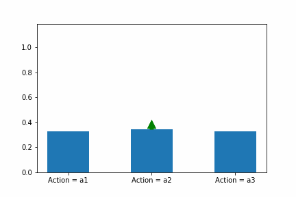

# DEEP DETERMINISTIC POLICY GRADIENTS

An RL agent interacts with its environment, takes an action, and learns more about the environment, influencing subsequent actions and learning. Like an RL agent, we will first take an action that takes us into the Policy Gradient state. Once we have a basic understanding of the policy gradient environment, we take our next action, which leads us to the Deterministic Policy Gradients state. We improve our learning further in this state. We finally take the action that leads us to our goal state, i.e., Deep Deterministic Policy Gradients.

**Let's head to our start state - Policy Gradients**

# 1. Policy Gradients

## 1.1 Definition
Policy gradient methods learn a parameterized policy that can select actions without consulting a value function. They model and optimize the policy directly.

$$\pi(a|s, \theta)=Pr\{A_{t} = a\ | S_{t} = s, \theta_{t} = \theta\}$$

This equation denotes the probability that action a is taken at time t given that the environment is in state s at time t with parameter $\theta$.

An example of a policy:
\begin{equation*}
\pi(a|s, \theta) = \frac{e^{h(s, a, \theta)}} {\sum_{b}{e^{h(s, b, \theta)}}}
\end{equation*}

Reminds you of the softmax equation we so often see in machine learning, doesn't it?
We call this kind of policy parameterization as as *softmax in action preferences*.
Like in machine learning we would have $h(s, a, \theta) = \theta^T x(s, a)$ where $x(s, a)$ is a feature vector and $\theta$ are the weights.

**Now that we've covered the *Policy* portion, let's move on to the *Gradient* portion.**

## 1.2 Policy Gradient Theorem
Let's define our expected reward. We represent the total reward for a given trajectory $\tau$ as $r(\tau)$.<br />

$$J(\theta) = {E_{\pi}}[r(\tau)]$$ <br />
As we've seen before the expected reward is the value of the start state $s_{0}$ under a policy $\pi_{\theta}$.<br />
Therefore we have:<br />
$$J(\theta) = v_{\pi_{\theta}}(s_{0}) = {E_{\pi}}[r(\tau)]$$

The equations look pretty cool, but what next?<br />
We can derive some intuition from the loss functions used in machine learning. A loss function is defined with respect to the parameters $\theta$ and we use **gradient descent** to find the parameters $\theta$ that minimize the loss. 

$$\theta_{t+1} = \theta_{t} - \alpha \nabla L(\theta_{t})$$

In Reinforcement Learning, however, we want to maximize the expected reward, so what do we do? Well, pretty simple, we go up instead of down, i.e., **gradient ascent** instead of gradient descent.

$$\theta_{t+1} = \theta_{t} + \alpha \nabla J(\theta_{t})$$
>*When the solution is simple, God is answering. - Albert Einstein*

We're going to use gradient ascent to maximize our expected reward, but before we can do that, we need to define the following derivative $\nabla J(\theta_{t})$.
Now we can derive this, but we're going to save ourselves some time and present the answer:

$$\nabla J(\theta_{t}) = \nabla_{\theta} \sum_{s}\mu(s)\sum_{a}q_{\pi}(s, a)\pi_{\theta}(a|s,\theta)$$
$$\nabla J(\theta_{t}) \propto \sum_{s}\mu(s)\sum_{a}q_{\pi}(s, a)\nabla_{\theta}\pi_{\theta}(a|s,\theta)$$

This can be proved mathematically, but for now, we're just going to believe that we have the right answer.<br />
Our gradient update can now be written as:
$$\theta_{t+1} = \theta_{t} + \alpha \nabla J(\theta_{t})$$
$$\theta_{t+1} = \theta_{t} + \alpha \sum_{s}\mu(s)\sum_{a}q_{\pi}(s, a)\nabla_{\theta}\pi_{\theta}(a|s,\theta)$$

*There you are, left alone, lost in a mountain range surrounded by snow. What do you do? You decide to get to the highest point and light up a flare so that someone can come to rescue you. Turns out what you are going to do is gradient ascent. Look as far as you can in every direction and find the direction that gets you the highest. Go in that direction.*


Now that we have defined our gradient update let's take a look at an example to solidify our understanding.

### 1.2.1 Example

Lets consider an MDP with a single state $s$ and three actions $a_{1}, a_{2}, a{_3}$. Lets assume we start off with an approximate q_value function $q(s, a)$.\
Since we have only one state we can ignore the $\sum_{s}\mu(s)$ term.\
Let's use the *softmax in action preferences* policy:
\begin{equation*}
\pi(a|s, \theta) = \frac{e^{h(s, a, \theta)}} {\sum_{b}{e^{h(s, b, \theta)}}}
\end{equation*}
So out gradient update will be:

$$\theta_{t+1} = \theta_{t} + \alpha \sum_{a}q_{\pi}(s, a)\nabla_{\theta}\pi_{\theta}(a|s,\theta)$$
Let $a1$ be the optimal action in state $s$.

If we apply policy gradient to this example, we would want
\begin{equation*}
\pi(a1|s, \theta) = \frac{e^{h(s, a1, \theta)}} {\sum_{b}{e^{h(s, b, \theta)}}} \approx 1
\end{equation*}

\begin{equation*}
\pi(a2|s, \theta) = \frac{e^{h(s, a2, \theta)}} {\sum_{b}{e^{h(s, b, \theta)}}} \approx 0
\end{equation*}

\begin{equation*}
\pi(a3|s, \theta) = \frac{e^{h(s, a3, \theta)}} {\sum_{b}{e^{h(s, b, \theta)}}} \approx 0
\end{equation*}

As seen in the example below, as the agent interacts with the environment it performs a gradient update. It updates the parameters $\theta$ to maximize the reward $J(\theta)$. The parameter updates take a step in the direction of the expected reward. The updates should increase the weights $\theta$ for features $x(s,a1)$ corresponding to action $a1$ and decrease the weights $\theta$ for features $x(s,a2)$ and $x(s,a3)$ corresponding to actions $a2$ and $a3$.

As the agent continues to interact with the environment, gradient ascent updates the parameters $\theta$ which increases the value of $h(s,a1,\theta)$ and decreases the value of $h(s,a2,\theta)$ and $h(s,a3,\theta)$. This leads to an increase in the softmax probability of action $a1$ and decrease the softmax probability of actions $a2$ and $a3$. The probability of action $a1$ gets closer to 1 while the probability of actions $a2, a3$ get closer to 0



## 1.3 Why Policy Gradients

We've seen how policy gradients work, but we haven't yet convinced you on why you would want to use them. We're going to try and do that now.

### 1.3.1 Advantages

#### 1.3.1.1 Convergence
* Policy based methods have better convergence properties.
* The problem with value based methods is the choice of action may vary for a small change in the estimated Q values. Since the action can vary for small changes, the value functions tend to vary in every iteration.
* In Policy Gradient, we use gradient ascent. We move the $\theta$ values in the direction of the gradient $\nabla_{\theta}J(\theta)$. Since we follow the gradient, we're guaranteed to converge to a local maximum (worst case) or a global maximum (best case).


#### 1.3.1.2 High Dimensional Action Spaces
* Policy gradients are more useful in conntinuing tasks or tasks that contain a very large action space.
* The problem with GPI algorithms, is the action predictions are based on the maximum expected reward for each possible action, at each time step, given the current state. This requires a search of the entire action space and this is what we call the curse of dimensionality.
* Policy gradients, on the other hand, would just require a feature vector h(s, a, \theta), a set of adjustable parameters, to perform the softmax computation and pick an action. 


#### 1.3.1.3 Stochastic Policies
* Policy gradients can learn stochastic policies. We've already seen an example of a stochastic policy, the softmax policy:
\begin{equation*}
\pi(a|s, \theta) = \frac{e^{h(s, a, \theta)}} {\sum_{b}{e^{h(s, b, \theta)}}}
\end{equation*}
* Value based methods are unable to learn stochastic policies.
* An advantage of stochastic policies is we don't need to have an exploitation v/s exploration trade off.

### 1.3.2 Disadvantages
#### 1.3.2.1 Convergence
* An obvious disadvantage is that the gradient ascent can converge to local maximum instead of the global maixmum, which would yield a suboptimal policy.


**Now that we have a better understanding of the policy gradients state, we take 
the forward action and move to our next state - Deterministic Policy Gradients**

# 2. Deterministic Policy Gradients


```python
#To-DO
```


```python

```
